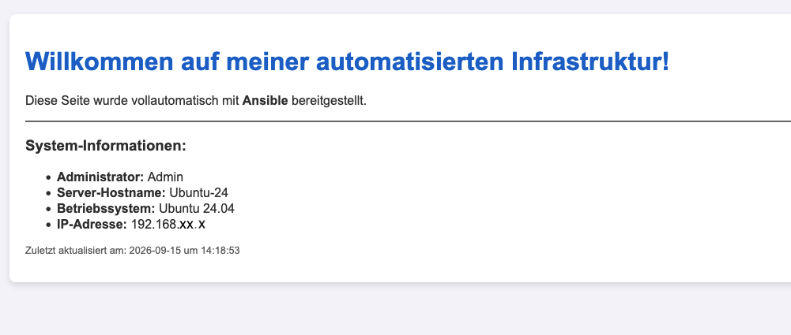
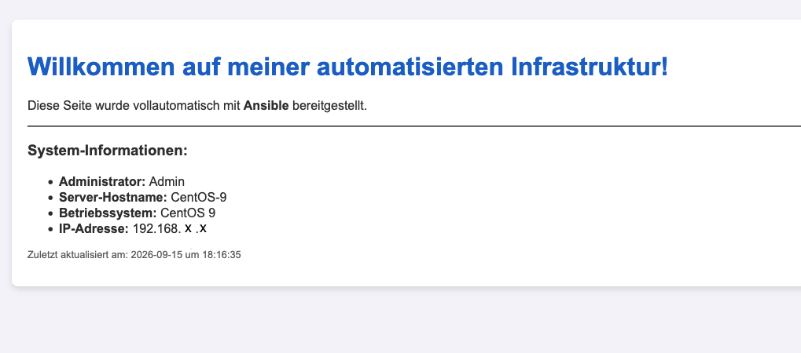

# Ansible & Linux Learning Lab

Willkommen in meinem IT-Praxis-Repository! Als ambitionierter IT-Quereinsteiger nutze ich dieses Projekt, um meine theoretischen Kenntnisse aus der **LPIC-1 Zertifizierung** direkt in einer realitätsnahen Infrastruktur anzuwenden, zu härten und vollständig zu automatisieren.

## ️ Mein Setup & Tech Stack
* **Betriebssysteme (VMs):** Ubuntu 24.04 (Debian-Basis) & CentOS 9 Stream (RHEL-Basis) emuliert via **UTM**.
* **Verbindung & CLI:** Konsequente Administration remote über **SSH** unter Verwendung von **iTerm2** (macOS).
* **Configuration Management:** **Ansible (Core 2.21+)** zur Automatisierung von Systemkonfigurationen und administrativen Aufgaben.
* **Version Control:** Git & GitHub via Command Line Interface (CLI).

## Projekt-Fokus: Infrastructure as Code (IaC), Hardening & Vaulting
In diesem Repository dokumentiere ich meine Schritte mit Ansible. Der Fokus liegt darauf, wiederkehrende Administrator-Aufgaben in wiederverwendbaren Code zu gießen und Systeme ab dem ersten Moment nach Enterprise-Sicherheitsstandards abzuriegeln.

### Aktuelle Features:
* **Automatisierte Benutzerverwaltung mit Ablaufrichtlinie:** Sichere Anlage von Benutzern inklusive erzwungenem Passwortwechsel beim allerersten Login via Linux-Ablaufdatum-Steuerung.
* **Multi-OS Kompatibilität & Clean Code:** Anpassung von Tasks an die Besonderheiten von `apt` (Ubuntu) und `dnf` (CentOS 9) unter strikter Verwendung moderner Ansible-Syntax (`ansible_facts['os_family']`).
* **Automated SSH-Hardening:** Vollautomatische Absicherung des SSH-Zugangs (Port-Wechsel auf `2222`, Abschaltung von Passwort-Logins, Verbot von direktem Root-Login).
* **Enterprise Secret Management:** Vollständige AES-256-Bit-Verschlüsselung aller sensiblen Daten über **Ansible-Vault**.

## Zertifizierungen & Status
* **LPIC-1 (Prüfung 101-500):** Erfolgreich abgeschlossen mit **92,5%**.
* **LPIC-1 (Prüfung 102-500):** In Vorbereitung (Prüfungstermin 02. Oktober 2026).

---
*Dieses Repository zeigt meine Reise in die Linux-Systemadministration. Ich nutze praxisnahe Tools, um Code strukturiert zu testen und in meinem Lab zu implementieren.*

---

# Enterprise Ansible Architecture: Multi-OS Hardening, Webserver & Automated Patching

Dieses Repository demonstriert die automatisierte Bereitstellung, Konfiguration und dynamische Inhaltspflege von Nginx-Webservern mittels einer **modularen Ansible-Rollenstruktur (Roles)**. Das Setup beinhaltet eine vorgeschaltete Sicherheits-Härtung, ist vollständig **plattformübergreifend** (Ubuntu & CentOS 9) und für ein **vollautomatisches, hintergrundbasiertes System-Patching via Cronjob (Zero-Touch-Infrastruktur)** ausgelegt.

Das Projekt wurde nach Best-Practice-Ansätzen für produktionsreife Infrastructure as Code (IaC) in einer lokalen Laborumgebung (macOS, UTM/ARM, iTerm2) entwickelt.

| Ubuntu Server | CentOS 9 Server |
| :---: | :---: |
|  |  |

## Key Features & Multi-OS-Architektur

* **Vorgeschaltetes SSH-Hardening:** Bevor Anwendungssoftware installiert wird, sichert die Rolle `ssh_hardening` die Systeme ab. Sie verschiebt den SSH-Port auf `2222`, erzwingt reine Schlüssel-Authentifizierung (`PasswordAuthentication no`) und verbietet den direkten Root-Zugriff.
* **Plattformübergreifendes Deployment:** Intelligente Erkennung der Betriebssystem-Familie mittels Ansible Facts zur Laufzeit. Ansible wählt vollautomatisch den richtigen Paketmanager (`apt` vs. `dnf`) und die korrekten Web-Pfade.
* **Zero-Touch Automation (Cronjob):** Das System-Update-Playbook (`update_system.yml`) ist für die vollautomatische, passwortlose Ausführung im nächtlichen Wartungsfenster konfiguriert.
* **Geheimnis-Schutz (Ansible-Vault):** Sämtliche sicherheitskritischen Variablen (wie verschlüsselte Linux-Passwörter) sind per AES-256 kryptografisch geschützt. Sie können gefahrlos im Repository eingecheckt werden, während das Master-Passwort lokal isoliert bleibt.
* **Modularität via Roles:** Strikte Trennung von Logik und Konfiguration durch die Auslagerung des Codes in die wiederverwendbaren Rollen `ssh_hardening`, `webserver` und `users`.
* **Dynamische Jinja2-Templates:** Die `index.html` wird zur Laufzeit dynamisch generiert. Sie liest automatisch die Live-Systemdaten der jeweiligen VM (Hostname, OS-Distribution, IP-Adresse) sowie benutzerdefinierte Variablen aus.
* **Idempotenz:** Sichere Mehrfachanwendung der Playbooks ohne ungewollte Systemveränderungen.

## Projektstruktur

```text
ansible-lernen/
├── group_vars/
│   └── meine_server/       # Strukturierter Gruppenvariablen-Ordner
│       ├── db_and_web.yml  # Öffentliche Variablen (z. B. Webseiten-Titel)
│       └── vault.yml       # Mit AES-256 verschlüsselte Geheimnisse (Vault)
├── roles/
│   ├── ssh_hardening/      # Gekapselte Sicherheits-Rolle
│   │   ├── handlers/
│   │   │   └── main.yml    # Plattformübergreifender SSH-Neustart (ternary)
│   │   └── tasks/
│   │       └── main.yml    # Firewall-Regeln, SELinux-Kontext & sshd_config
│   ├── webserver/          # Gekapselte Multi-OS Webserver-Rolle
│   │   └── tasks/
│   │       └── main.yml    # Dynamische Installations- und Firewall-Schritte
│   └── users/              # Gekapselte Rolle für die Benutzerverwaltung
│       └── tasks/
│           └── main.yml    # NEU: Einmalpasswort & erzwungener Passwortwechsel
├── .gitignore              # Schützt sensible lokale Passwort- & Inventardateien
├── .vault_password.example # Anonymisierte Struktur-Vorlage für das Vault-Passwort
├── hosts                   # Lokales Inventory (via .gitignore geschützt)
├── hosts.example           # Anonymisierte Vorlage für das Inventory (Port 2222)
├── site.yml                # Haupt-Playbook (Master-Playbook)
└── update_system.yml       # Skript für automatisierte System-Updates
```

##️Voraussetzungen & Nutzung
* **Control Node:** macOS mit installiertem Ansible (`brew install ansible`)
* **Managed Nodes:** Ubuntu Linux & CentOS Stream 9 (Erreichbar via SSH-Key-Authentifizierung)
* **Inventory:** Eine lokale Datei namens `hosts` mit der Gruppe `[meine_server]` (wird via `.gitignore` nicht ins Repository gepusht).

### Lokales Vault-Setup (Erstmalige Einrichtung)
Da die Datei `.vault_password` aus Sicherheitsgründen per `.gitignore` blockiert wird, muss vor der Ausführung die lokale Kennwortdatei aus der Struktur-Vorlage erstellt werden:
```bash
cp .vault_password.example .vault_password
# Ersetze danach den Platzhaltertext in .vault_password durch dein echtes Master-Passwort
```

### Der allererste Start (Initiales Setup)
Da die Server beim allerersten Durchlauf im Werkszustand noch auf Port 22 lauschen, muss der neue SSH-Port beim initialen Start einmalig als Variable übergeben und die Vault-Passwortdatei deklariert werden:
```bash
ansible-playbook -i hosts site.yml --vault-password-file .vault_password -e "ansible_port=22"
```

### Zukünftige Starts & System-Prüfung
Nach dem ersten Durchlauf greifen die neuen Sicherheitsregeln permanent. Ansible liest den geänderten Port `2222` nun direkt aus der `hosts`-Datei aus:
```bash
ansible-playbook -i hosts site.yml --vault-password-file .vault_password
```

### Automatisierte Hintergrund-Ausführung (Wartungsfenster)
Um das System-Patching vollautomatisch jeden Tag um 16:00 Uhr ohne menschliche Passworteingabe auszuführen, wird auf dem Control Node ein Cronjob eingerichtet.
*Voraussetzungen:* Der Service-User `ansible` besitzt passwortlose Sudo-Rechte via `visudo` (`NOPASSWD:ALL`). Der Dienst `cron` besitzt in den macOS-Systemeinstellungen den *Festplattenvollzugriff (Full Disk Access)*, um Logdateien in Benutzerverzeichnisse schreiben zu dürfen.

Eintrag in der `crontab -e` des Control Nodes:
```text
0 16 * * * cd "/Users/dein_username/Documents/IT /ansible-lernen" && /opt/homebrew/bin/ansible-playbook -i hosts update_system.yml -u ansible --vault-password-file .vault_password >> "/Users/dein_username/Documents/IT /ansible-lernen/ansible_cron.log" 2>&1
```

## Reales Troubleshooting im Labor (Lessons Learned)
Während des Setups wurden folgende praxisnahe Infrastruktur-Hürden erfolgreich identifiziert und über die Linux-CLI gelöst:

* **Sichere Vergabe von Einmalpasswörtern (LPIC-1 102):** Im Enterprise-Umfeld dürfen Admins Passwörter neuer User nicht kennen. Gelöst wurde dies durch die Integration des Linux-Befehls `chage -d 0 <user>` direkt nach der Benutzeranlage. Linux interpretiert das Passwort dadurch als sofort abgelaufen und zwingt den Nutzer beim allerersten SSH-Login hart zu einer interaktiven Passwortänderung. Damit Ansible das geänderte Passwort bei künftigen Läufen nicht überschreibt, wurde die Direktive `update_password: on_create` verankert.
* **Echtzeit-Logging im Hintergrund (Cron):** Unter macOS blockiert das System standardmäßig Dateizugriffe durch Hintergrund-Daemons, wodurch Logfiles leer blieben. Gelöst durch die Erteilung von *Festplattenvollzugriff* für `/usr/sbin/cron` über iTerm2-CLI-Tricks und die Verwendung absoluter Verzeichnispfade sowie dem Zusammenführen von Standard- und Fehlerströmen (`2>&1`).
* **Automatisierung vs. Interaktivität:** Hintergrundprozesse können keine Passwörter eintippen. Gelöst durch die Umstellung auf passwortlose SSH-Key-Authentifizierung und die Absicherung der Ziel-VMs über restriktive `visudo`-Einträge (`NOPASSWD:ALL`).
* **Port-Konflikt durch Apache2 (Ubuntu & CentOS):** Sowohl unter Ubuntu (`apache2`) als auch unter CentOS 9 (`httpd`) blockierten vorinstallierte Apache-Dienste den Port 80. Gelöst durch die Integration automatischer Deinstallations-Tasks (`apt purge` / `dnf absent`) direkt im Ansible-Workflow.

