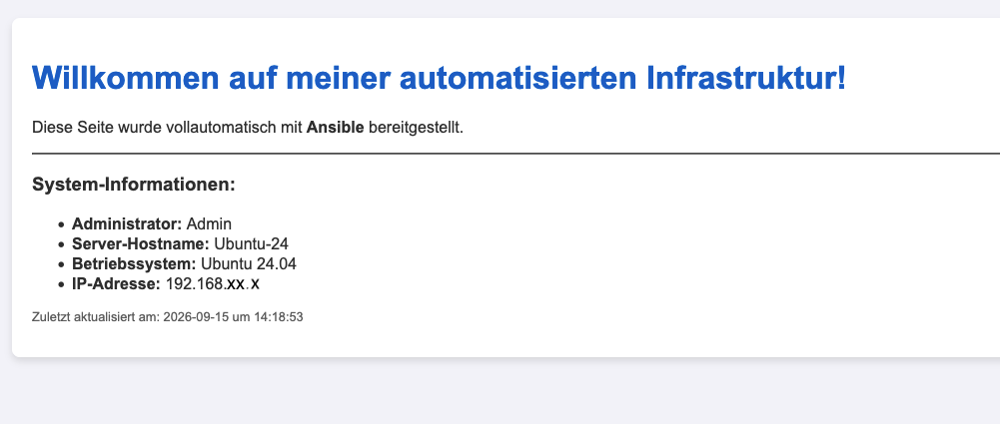
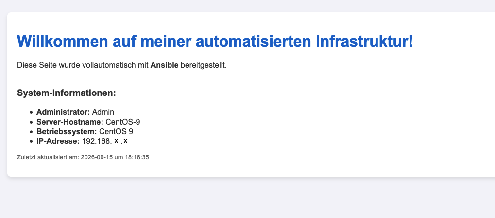

# Ansible & Linux Learning Lab

Willkommen in meinem IT-Praxis-Repository. Als IT-Quereinsteiger nutze ich dieses Projekt, um meine Kenntnisse aus der **LPIC-1 Zertifizierung** in einer realitätsnahen Infrastruktur anzuwenden, abzusichern und vollständig zu automatisieren.

Konkret geht es um die automatisierte Bereitstellung und Pflege von Nginx-Webservern über eine **modulare Ansible-Rollenstruktur**, mit vorgeschalteter Sicherheits-Härtung, durchgängig **plattformübergreifend** (Ubuntu 24.04 & CentOS 9 Stream) und mit einem Cronjob für automatisches System-Patching. Der Fokus liegt darauf, wiederkehrende Administrator-Aufgaben in wiederverwendbaren Code zu gießen, statt sie von Hand zu wiederholen.

Entwickelt und getestet in einer lokalen Laborumgebung (macOS, UTM/ARM, iTerm2).

| Ubuntu Server | CentOS 9 Server |
| :---: | :---: |
|  |  |

## Setup & Tech Stack

* **Betriebssysteme (VMs):** Ubuntu 24.04 (Debian-Basis) & CentOS 9 Stream (RHEL-Basis), emuliert via **UTM**.
* **Verbindung & CLI:** Administration remote über **SSH**, unter **iTerm2** (macOS).
* **Configuration Management:** **Ansible (Core 2.21+)** für Systemkonfiguration und administrative Aufgaben.
* **Version Control:** Git & GitHub über die Kommandozeile.

## Features

* **Vorgeschaltetes SSH-Hardening:** Bevor Anwendungssoftware installiert wird, sichert die Rolle `ssh_hardening` die Systeme ab. Sie verschiebt den SSH-Port auf `2222`, erzwingt reine Schlüssel-Authentifizierung (`PasswordAuthentication no`) und verbietet den direkten Root-Zugriff. Die Änderung an der `sshd_config` wird vor dem Schreiben mit `sshd -t` geprüft, damit ein Fehler nicht den Zugang kostet.
* **Benutzerverwaltung mit Ablaufrichtlinie:** Anlage von Benutzern inklusive erzwungenem Passwortwechsel beim allerersten Login, gesteuert über das Linux-Ablaufdatum (`chage -d 0`).
* **Plattformübergreifendes Deployment:** Erkennung der Betriebssystem-Familie über Ansible Facts zur Laufzeit. Ansible wählt selbsttätig den richtigen Paketmanager (`apt` vs. `dnf`), die passenden Dienstnamen (`ssh` vs. `sshd`) und die korrekten Web-Pfade.
* **Moderne Fact-Syntax, bewusst vorgezogen:** Facts werden durchgängig als `ansible_facts['…']` gelesen, nie als Top-Level-Variablen. In der `ansible.cfg` ist `inject_facts_as_vars = False` gesetzt — der Standard ab ansible-core 2.24. Dadurch fällt eine veraltete Schreibweise sofort auf, statt beim Upgrade still ins Leere zu laufen.
* **Zentrale Projektkonfiguration:** Inventar und Vault-Passwortdatei sind in der `ansible.cfg` hinterlegt. Jeder Aufruf — auch der aus dem Cronjob — kommt damit ohne zusätzliche Parameter aus.
* **Automatisches System-Patching (Cronjob):** Das Playbook `update_system.yml` läuft täglich um 16:00 Uhr ohne Passworteingabe.
* **Geheimnis-Schutz (Ansible-Vault):** Sicherheitskritische Variablen sind per AES-256 verschlüsselt. Sie können gefahrlos im Repository liegen, während das Master-Passwort lokal bleibt und nie eingecheckt wird.
* **Modularität via Roles:** Trennung von Logik und Konfiguration durch Auslagerung in die Rollen `ssh_hardening`, `webserver` und `users`.
* **Dynamische Jinja2-Templates:** Die `index.html` wird zur Laufzeit erzeugt und liest die Live-Systemdaten der jeweiligen VM (Hostname, Distribution, IP-Adresse) sowie eigene Variablen aus.
* **Idempotenz — mit einer bewussten Ausnahme:** Pakete, Dienste, Benutzer und Konfigurationsdateien werden nur angefasst, wenn sie vom Sollzustand abweichen; ein zweiter Lauf meldet für sie `changed=0`. Ausgenommen ist das Jinja2-Template: Es schreibt den Erzeugungszeitpunkt in die Seite, weshalb das `template`-Modul bei **jedem** Lauf `changed` meldet. Das ist bewusst in Kauf genommen, damit auf der Seite sichtbar bleibt, wann sie zuletzt erzeugt wurde — es ist der einzige Task im Repository, auf den das zutrifft.

## Projektstruktur

```text
ansible-lernen/
├── ansible.cfg             # Inventar, Vault-Passwortdatei, Fact-Verhalten
├── group_vars/
│   └── meine_server/       # Strukturierter Gruppenvariablen-Ordner
│       ├── db_and_web.yml  # Öffentliche Variablen (Webseiten-Titel, Interpreter)
│       └── vault.yml       # Mit AES-256 verschlüsselte Geheimnisse (Vault)
├── roles/
│   ├── ssh_hardening/      # Gekapselte Sicherheits-Rolle
│   │   ├── handlers/
│   │   │   └── main.yml    # Plattformübergreifender SSH-Neustart (ternary)
│   │   └── tasks/
│   │       └── main.yml    # Firewall-Regeln, SELinux-Kontext & sshd_config
│   ├── users/              # Gekapselte Rolle für die Benutzerverwaltung
│   │   └── tasks/
│   │       └── main.yml    # Einmalpasswort & erzwungener Passwortwechsel
│   └── webserver/          # Gekapselte Multi-OS Webserver-Rolle
│       ├── tasks/
│       │   └── main.yml    # Apache entfernen, Nginx, Firewall, Template
│       └── templates/
│           └── index.html.j2
├── .gitignore              # Schützt lokale Passwort- & Inventardateien
├── .vault_password.example # Vorlage für die lokale Vault-Passwortdatei
├── hosts                   # Lokales Inventory (via .gitignore geschützt)
├── hosts.example           # Anonymisierte Vorlage für das Inventory (Port 2222)
├── create_ansible_user.yml # Legt den Service-User für die Automatisierung an
├── site.yml                # Haupt-Playbook (users, ssh_hardening, webserver)
└── update_system.yml       # Playbook für automatisierte System-Updates
```

## Voraussetzungen & Nutzung

* **Control Node:** macOS mit installiertem Ansible (`brew install ansible`)
* **Managed Nodes:** Ubuntu Linux & CentOS Stream 9, erreichbar via SSH-Key-Authentifizierung
* **Inventory:** Eine lokale Datei `hosts` mit der Gruppe `[meine_server]` (wird via `.gitignore` nicht eingecheckt — als Vorlage dient `hosts.example`)

### Lokales Vault-Setup (erstmalige Einrichtung)

Die Datei `.vault_password` ist per `.gitignore` ausgeschlossen und muss lokal aus der Vorlage erzeugt werden:

```bash
cp .vault_password.example .vault_password
chmod 600 .vault_password
# Platzhaltertext durch das eigene Master-Passwort ersetzen
```

Ein langes Zufallspasswort erzeugt man am einfachsten so:

```bash
openssl rand -base64 30 > .vault_password
chmod 600 .vault_password
```

### Der allererste Start (initiales Setup)

Beim ersten Durchlauf lauschen die Server noch im Werkszustand auf Port 22. Der abweichende Port wird deshalb einmalig als Variable übergeben:

```bash
ansible-playbook site.yml -e "ansible_port=22"
```

### Weitere Starts

Danach greifen die Sicherheitsregeln dauerhaft, und Ansible liest den Port `2222` aus der `hosts`-Datei. Inventar und Vault-Passwort kommen aus der `ansible.cfg`:

```bash
ansible-playbook site.yml
```

Ein gefahrloser Trockenlauf, der nichts verändert und die anstehenden Unterschiede zeigt:

```bash
ansible-playbook site.yml --check --diff
```

### Automatisierte Hintergrund-Ausführung

Das System-Patching läuft täglich um 16:00 Uhr ohne Passworteingabe über einen Cronjob auf dem Control Node.

*Voraussetzungen:* Der Service-User `ansible` besitzt passwortlose Sudo-Rechte via `visudo` (`NOPASSWD:ALL`). Der Dienst `cron` benötigt in den macOS-Systemeinstellungen den *Festplattenvollzugriff*, um Logdateien in Benutzerverzeichnisse schreiben zu dürfen.

Eintrag in der `crontab -e`:

```text
0 16 * * * cd "/Users/dein_username/Documents/IT /ansible-lernen" && /opt/homebrew/bin/ansible-playbook update_system.yml -u ansible >> "/Users/dein_username/Documents/IT /ansible-lernen/ansible_cron.log" 2>&1
```

Die Uhrzeit ist bewusst nachmittags gewählt: Der Control Node ist ein Notebook. Nachts ist es aus oder im Ruhezustand, und `cron` holt unter macOS verpasste Läufe nicht nach — ein nächtliches Wartungsfenster würde nie ausgeführt.

## Reales Troubleshooting im Labor (Lessons Learned)

Während des Setups sind folgende praxisnahe Hürden aufgetreten und über die Linux-CLI gelöst worden:

* **Sichere Vergabe von Einmalpasswörtern (LPIC-1 102):** Admins sollen die Passwörter neuer Benutzer nicht kennen. Gelöst über `chage -d 0 <user>` direkt nach der Benutzeranlage: Linux behandelt das Passwort damit als sofort abgelaufen und erzwingt beim ersten SSH-Login eine interaktive Änderung. Damit Ansible das vom Benutzer gewählte Passwort später nicht überschreibt, ist `update_password: on_create` gesetzt.
* **Idempotenz und der zufällige Salt (`password_hash`):** Der Filter `password_hash('sha512')` erzeugt bei jedem Aufruf einen neuen Salt und damit einen anderen Hash. Ohne Gegenmaßnahme würde das `user`-Modul das Passwort bei jedem Lauf neu setzen und `changed` melden — das Playbook wäre nicht idempotent. `update_password: on_create` löst beides auf einmal: Es schützt das gewählte Passwort und hält den Task zugleich unveränderlich.
* **Port-Konflikt durch vorinstallierten Apache:** Sowohl unter Ubuntu (`apache2`) als auch unter CentOS 9 (`httpd`) belegten vorinstallierte Apache-Dienste den Port 80 und verhinderten den Start von Nginx. Gelöst durch Deinstallations-Tasks je Distribution (`apt` mit `purge` / `dnf` mit `state: absent`) direkt im Workflow, noch vor der Nginx-Installation.
* **Echtzeit-Logging im Hintergrund (Cron):** Unter macOS blockiert das System Dateizugriffe durch Hintergrund-Daemons, wodurch die Logdatei leer blieb. Gelöst durch *Festplattenvollzugriff* für `/usr/sbin/cron`, absolute Pfade im Cron-Eintrag und das Zusammenführen von Standard- und Fehlerausgabe (`2>&1`).
* **Automatisierung vs. Interaktivität:** Hintergrundprozesse können keine Passwörter eintippen. Gelöst durch passwortlose SSH-Key-Authentifizierung und restriktive `visudo`-Einträge auf den Ziel-VMs.
* **Eine Einstellung an zwei Orten:** Der Python-Interpreter stand sowohl im Inventar als auch in den Gruppenvariablen — im Inventar mit einem Tippfehler im Variablennamen, den Ansible stillschweigend ignoriert. Weil die zweite Stelle korrekt war, fiel der Fehler nie auf. Seitdem wird der Interpreter nur noch an einer Stelle gesetzt.

## Zertifizierungen & Status

* **LPIC-1 (Prüfung 101-500):** Erfolgreich abgeschlossen mit **92,5 %** (740/800 Punkte).
* **LPIC-1 (Prüfung 102-500):** Erfolgreich abgeschlossen mit **97,5 %** (780/800 Punkte).

---

*Dieses Repository zeigt meinen Weg in die Linux-Systemadministration — praxisnah aufgebaut, getestet und dokumentiert.*
